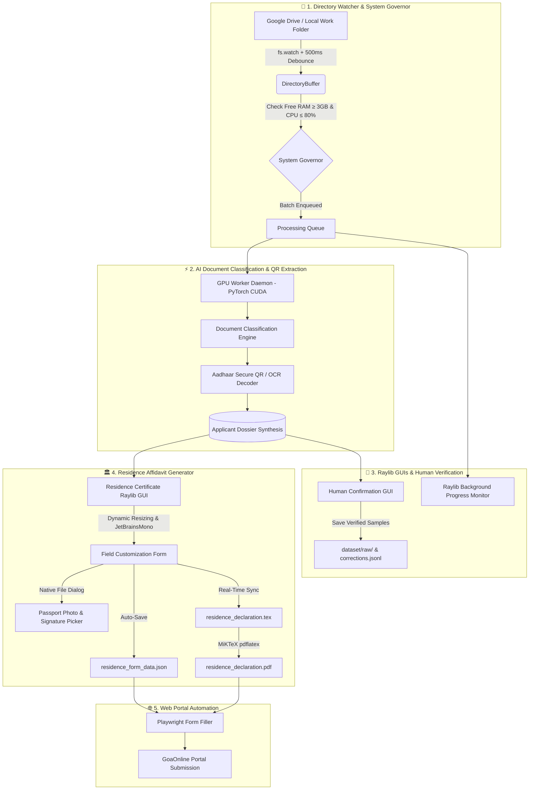

# 🏛️ GoaOnAuto

> **Automated Document Intelligence, Affidavit Generation & Portal Submission Engine for Goa Citizen Services**

[](https://www.typescriptlang.org/)
[](https://bun.sh/)
[](https://www.python.org/)
[-white?logo=c&logoColor=black)](https://www.raylib.com/)
[](https://developer.nvidia.com/cuda-zone)
[](https://miktex.org/)

GoaOnAuto is an end-to-end intelligent automation system designed to eliminate manual administrative friction in processing Goa government applications (such as Residence Certificates on the GoaOnline portal). It monitors incoming applicant folders, classifies documents using an RTX 4060 GPU engine, extracts demographic ground truth from secure Aadhaar QR codes and OCR, provides an interactive Raylib GUI for affidavit customization, compiles pixel-perfect single-page LaTeX legal declarations, and auto-populates portal forms using Playwright.

---

## 📑 Table of Contents
- [Architecture Overview](#-architecture-overview)
- [Key Features](#-key-features)
- [Project Structure](#-project-structure)
- [Prerequisites](#-prerequisites)
- [Installation & Setup](#-installation--setup)
- [Usage & Commands](#-usage--commands)
  - [1. Residence Certificate Affidavit GUI](#1-residence-certificate-affidavit-gui)
  - [2. Automated Directory Watcher](#2-automated-directory-watcher)
  - [3. QR Code Generation & Testing](#3-qr-code-generation--testing)
  - [4. AI Dataset & Model Retraining](#4-ai-dataset--model-retraining)
- [Configuration (.env)](#-configuration-env)
- [License](#-license)

---

## 🏗️ Architecture Overview



---

## ✨ Key Features

### 🏛️ 1. Residence Certificate Affidavit Automation
- **Interactive Raylib GUI (`residence_gui.py`)**: A desktop interface rendered in Dracula theme with high-DPI JetBrains Mono typography.
- **Dynamic Window Resizing**: Automatically scales widget dimensions, button sizes, margins, and text sizes proportionally when the window is resized or maximized.
- **Declaration Mode Toggle**:
  - **Self Mode**: Uses `templates/latex/residence_self.tex` for individual applicants.
  - **Child Mode**: Dynamically shows child-specific keywords (`Child Name`, `Child Relation`) and compiles `templates/latex/residence_child.tex`.
- **Live `.tex` Synchronization**: Edits in the GUI instantly update `residence_declaration.tex` in the client directory using safe lambda replacements that prevent backslash corruption.
- **Single-Page Affidavit Fit**: Automatically applies `\onehalfspacing` to ensure the declaration text, photo box, place/date, and signature block fit onto a single A4 page.
- **Native File Picker Integration**: Auto-detects missing or invalid photo/signature paths and launches native Windows file dialogs (`tkinter.filedialog`).
- **MiKTeX `pdflatex` Compilation**: Compiles the LaTeX template into `residence_declaration.pdf` in `<2 seconds` and opens it in your default PDF viewer.
- **Client Directory Data Persistence**: Automatically exports `residence_form_data.json` and updates `applicant_dossier.json` for headless portal submission.

### ⚡ 2. GPU Daemon & Document Classifier
- **Persistent PyTorch CUDA Engine**: Utilizes local NVIDIA GeForce RTX 4060 GPU with a strict 90% VRAM cap to process multi-page documents simultaneously.
- **Document Categories**: Aadhaar Cards, Residence Certificates, Bonafide School Certificates, Academic Marksheets, Passport Photos, and Signatures.
- **Hardware System Governor**: Protects system responsiveness by ensuring at least 3GB of free RAM and at least 20% free CPU capacity before initiating new batches.

### 🔍 3. Aadhaar QR Code Intelligence
- **Dual-Format Decoding**: Decodes legacy XML Aadhaar QR codes as well as compressed Secure e-Aadhaar V2/V3 QR codes (decompressing gzip payloads and parsing `\xff` delimited fields).
- **Golden Source Truth**: Demographic details (name, DOB, gender, house, street, village/town, taluka, pincode) extracted directly from the QR code achieve 100% accuracy, eliminating OCR typos.
- **QR Code Generator**: Built-in CLI utility to generate standard text/URL QR codes or synthetic Aadhaar XML QR codes for testing.

### 🌐 4. GoaOnline Portal Automation
- **Playwright Automation**: Handles portal authentication, automated CAPTCHA solving with character whitelisting, and form navigation.
- **Page Object Models**: Modular POM architecture (`LoginPage`, `ApplicationPage`, `ResidenceCertificateFormPage`) that loads verified client data directly from `residence_form_data.json`.

---

## 📁 Project Structure

```text
goaOnAuto/
├── assets/
│   ├── fonts/               # High-DPI JetBrainsMono-Regular & Bold TTF fonts
│   └── models/              # OpenCV YuNet face detection & ONNX models
├── dataset/                 # Model evaluation and harvested training data
│   ├── raw/                 # Verified training samples sorted by doc type
│   └── corrections.jsonl    # Historical human classification corrections
├── python/
│   ├── daemons/             # Persistent GPU worker daemon
│   ├── gui/
│   │   ├── confirmation_gui.py  # Raylib document verification dialog
│   │   ├── progress_gui.py      # Raylib background queue monitor
│   │   └── residence_gui.py     # Dynamic Raylib Residence Affidavit GUI
│   └── vision/
│       ├── aadhaar_qr.py    # Dual-format Aadhaar QR scanner & decoder
│       └── generate_qr.py   # OpenCV QR code generator utility
├── src/
│   ├── automation/
│   │   ├── pages/           # Playwright Page Object Models
│   │   ├── solver/          # Automated CAPTCHA solving logic
│   │   └── residenceCertificate.ts  # Bun runner for Residence GUI
│   ├── classifier/          # Dossier synthesis and multi-document deduction
│   ├── config/              # Centralized environment path resolver
│   ├── gui/                 # TypeScript IPC bridges to Raylib GUIs
│   ├── scanner/             # GPU daemon client & document pre-processing
│   ├── watcher/             # DirectoryBuffer, file watcher & SystemGovernor
│   └── workDirectoryWatcher.ts  # Main watcher service entrypoint
├── templates/
│   └── latex/               # Legal affidavit LaTeX templates
│       ├── residence_self.tex   # Self-declaration template
│       └── residence_child.tex  # Child-declaration template
├── tools/                   # Dataset harvesting, retraining & tray service
├── package.json
└── tsconfig.json
```

---

## 💻 Prerequisites

1. **Operating System**: Windows 10/11 (x64)
2. **Runtime Environments**:
   - [Bun](https://bun.sh/) (v1.2+) or Node.js (v20+)
   - [Python](https://www.python.org/downloads/) 3.11 - 3.13
3. **LaTeX Distribution**:
   - [MiKTeX](https://miktex.org/download) (installed and available in PATH or default path `C:\Users\<User>\AppData\Local\Programs\MiKTeX\miktex\bin\x64\pdflatex.exe`)
4. **Python Dependencies**:
   ```bash
   pip install pyray opencv-python numpy zlib torch torchvision pyzbar
   ```

---

## 🚀 Installation & Setup

1. **Clone the repository:**
   ```bash
   git clone https://github.com/Anosh26/goaOnAuto.git
   cd goaOnAuto
   ```

2. **Install Node/Bun dependencies:**
   ```bash
   bun install
   ```

3. **Configure environment paths:**
   Copy `.env.example` to `.env` and set your local directory paths:
   ```env
   # Root Work Directory to monitor for client folders
   DOCUMENT_WATCH_PATH="C:/Users/YourName/My Drive/Work"

   # System Python binary with pyray and torch installed
   PYTHON_BIN="C:/Users/YourName/AppData/Local/Programs/Python/Python313/python.exe"
   ```

---

## 🛠️ Usage & Commands

### 1. Residence Certificate Affidavit GUI
Launch the Raylib interactive GUI to review, customize, and compile the Residence Certificate declaration:

```bash
# Auto-detects the most recently updated applicant folder
bun run generate:residence

# Or specify an applicant directory explicitly:
bun run generate:residence "C:/Users/YourName/My Drive/Work/Client_Folder"
```
*Direct Python execution:*
```bash
python python/gui/residence_gui.py --dir "C:/path/to/client_folder"
```

### 2. Automated Directory Watcher
Starts the continuous background file system watcher and launches the persistent Raylib progress monitor:

```bash
bun run dev:watcher
```

### 3. QR Code Generation & Testing
Generate standard QR codes or synthetic Aadhaar XML QR codes for pipeline testing:

```bash
# Generate synthetic Aadhaar QR code:
bun run generate:qr --aadhaar --name "Applicant Name" --dob "15/08/1999" --taluka "Bardez" --out "test_qr.png"

# Generate standard URL / text QR code:
bun run generate:qr --text "https://goaonline.gov.in" --out "portal_qr.png"

# Scan and decode an Aadhaar QR code from an image:
bun run test:qr "path/to/aadhaar_scanned.jpg"
```

### 4. AI Dataset & Model Retraining
Harvest human-verified corrections and retrain the document classification model:

```bash
# Harvest labeled training samples from processed batches
bun run data:harvest

# Interactive CLI document labeling
bun run data:harvest-interactive

# Evaluate current model classification metrics
bun run data:evaluate

# Retrain classifier with newly collected data
bun run data:retrain
```

---

## ⚙️ Configuration (.env)

| Variable | Description | Default |
|---|---|---|
| `DOCUMENT_WATCH_PATH` | Root directory monitored by the watcher service | `work_directory/` |
| `PYTHON_BIN` | Path to system Python binary | System `python` |
| `MIN_FREE_RAM_GB` | Minimum free RAM in GB required before starting batches | `3.0` |
| `MAX_CPU_PERCENT` | Maximum allowed total CPU utilization percentage | `80.0` |
| `MAX_GPU_MEMORY_FRACTION` | Maximum fraction of GPU VRAM allocated to daemon | `0.90` |
| `ENABLE_HUMAN_CONFIRMATION`| Toggle Raylib interactive verification popups | `true` |

---

## 📄 License

This project is licensed under the ISC License.
